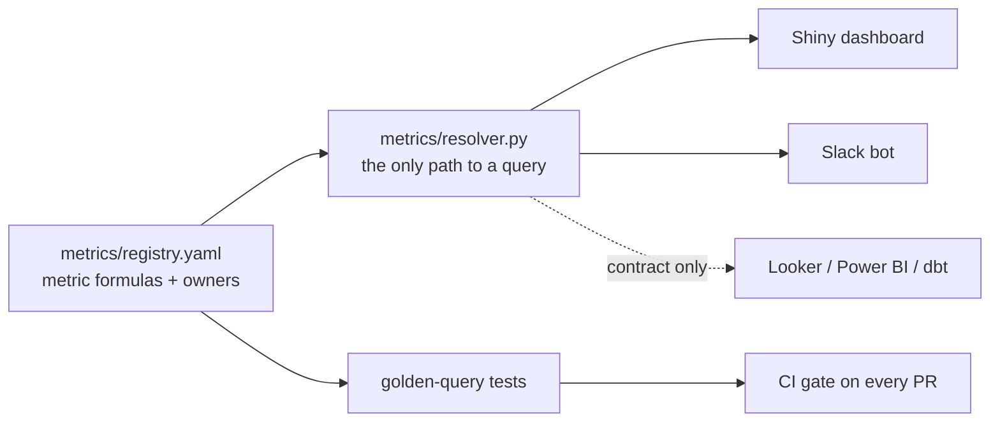

# bi-framework

**A reference architecture for AI-augmented BI teams** — one Git repo as
the shared source of truth for metric definitions, dashboards, and bots,
with Claude acting as a governed "mini analyst" against it instead of an
ungoverned code generator.

Built on a fully synthetic DTC e-commerce dataset. No real company data,
metrics, or business logic appear anywhere in this repo.



## The pitch

Give an analytics team a repo where:
- **Metrics are governed, not scattered.** One YAML registry defines every
  formula, with an owner and a pinned regression test. No dashboard, bot,
  or Claude session is allowed to define a metric inline — see
  [`docs/METRICS_REGISTRY.md`](docs/METRICS_REGISTRY.md).
- **Claude works from the same contract analysts do.** [`CLAUDE.md`](CLAUDE.md)
  is the instruction set every session reads first: where the registry
  lives, and that generating new dashboard code means calling it, not
  re-deriving a formula.
- **Multiple Claude sessions run in parallel without stepping on each
  other**, via `git worktree` — one analyst, several isolated branches at
  once. See [`docs/WORKTREE_WORKFLOW.md`](docs/WORKTREE_WORKFLOW.md).
- **A verification layer catches drift before it ships** — parameterized
  queries, golden-query regression tests, and a CI gate. See
  [`docs/VERIFICATION.md`](docs/VERIFICATION.md).
- **The same registry powers multiple platforms.** Shiny and a Slack bot
  are fully working; Looker, Power BI, and dbt are documented adapter
  contracts (see `platforms/*/README.md`) showing how the pattern extends
  without building four dashboard platforms for one demo.

Full write-up of the design decisions: [`docs/ARCHITECTURE.md`](docs/ARCHITECTURE.md).
Lessons from actually running this pattern: [`docs/FIELD_NOTES.md`](docs/FIELD_NOTES.md).

## See it

**Shiny dashboard** — value boxes and a chart, all sourced from the
registry, filterable by channel:


**Slack bot (local mock)** — a `/bi-report`-style modal flow (pick report
→ filters → format), delivering CSV, formatted Slack text, or an image
like this one, generated from the same registry:


## Run it yourself

Takes under five minutes, no external services or credentials required.

```bash
git clone <this-repo-url>
cd bi-framework
python -m venv .venv && source .venv/bin/activate
pip install -r requirements.txt

python data/generate_synthetic_data.py   # builds the synthetic warehouse

pytest tests/ -v                          # golden-query verification suite

shiny run platforms/shiny/app.py          # http://127.0.0.1:8000
python platforms/slack-bot/bot.py         # interactive terminal wizard
```

## Repo map

```
metrics/registry.yaml       canonical metric definitions (the source of truth)
metrics/resolver.py         the only module allowed to run a metric formula
data/                       synthetic DTC e-commerce data generator
platforms/shiny/            working dashboard
platforms/slack-bot/        working local-mock Slack bot
platforms/{looker,powerbi,dbt}/   documented adapter contracts, not built
tests/                      golden-query regression tests
.github/workflows/          CI gate enforcing the tests above on every PR
docs/                       architecture, governance, verification, and worktree docs
CLAUDE.md                   the contract Claude reads before touching this repo
```

## A private counterpart

A company-specific version of this playbook — real metrics, real platform
integrations, real rollout notes — is maintained privately and isn't part
of this repo by design. See [`docs/PRIVATE_PLAYBOOK.md`](docs/PRIVATE_PLAYBOOK.md).

## License

MIT — see [`LICENSE`](LICENSE).
