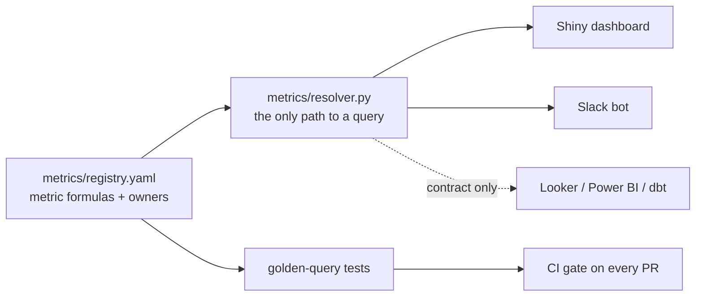
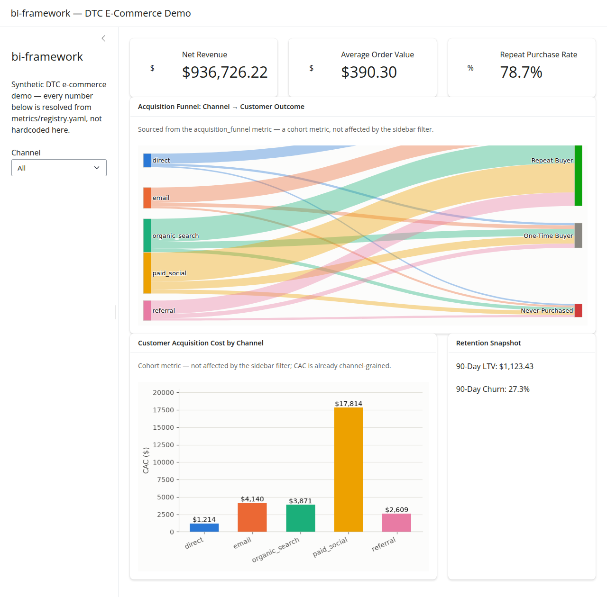
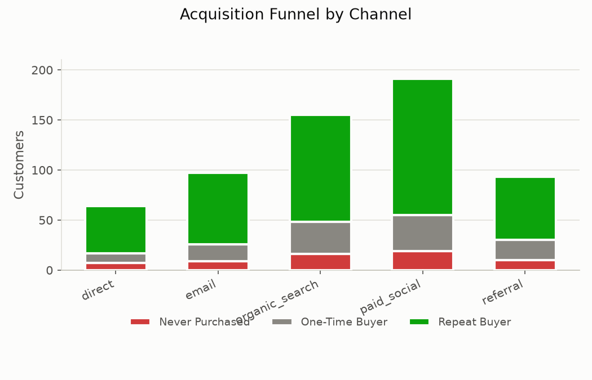

# bi-framework

**A reference architecture for AI-augmented BI teams** — one Git repo as
the shared source of truth for metric definitions, dashboards, and bots,
with an AI coding agent acting as a governed "mini analyst" against it
instead of an ungoverned code generator.

Built with Claude Code, but nothing about the governance model is
Claude-specific — see [Works with any agent, or none](#works-with-any-coding-agent-or-none)
below. Built on a fully synthetic DTC e-commerce dataset. No real company
data, metrics, or business logic appear anywhere in this repo.



## The pitch

Give an analytics team a repo where:
- **Metrics are governed, not scattered.** One YAML registry defines every
  formula, with an owner and a pinned regression test. No dashboard, bot,
  or Claude session is allowed to define a metric inline — see
  [`docs/METRICS_REGISTRY.md`](docs/METRICS_REGISTRY.md).
- **The AI agent works from the same contract analysts do.** [`CLAUDE.md`](CLAUDE.md)
  is the instruction set every Claude Code session reads first: where the
  registry lives, and that generating new dashboard code means calling
  it, not re-deriving a formula. Any other agent gets the same rule via
  its own instruction file — nothing enforcing it is Claude-specific.
- **Multiple agent sessions run in parallel without stepping on each
  other**, via `git worktree` — one analyst, several isolated branches at
  once. See [`docs/WORKTREE_WORKFLOW.md`](docs/WORKTREE_WORKFLOW.md).
- **A verification layer catches drift before it ships** — parameterized
  queries, golden-query regression tests, and a CI gate. See
  [`docs/VERIFICATION.md`](docs/VERIFICATION.md).
- **The same registry powers multiple platforms.** Shiny and a Slack bot
  are fully working; Looker, Power BI, and dbt are documented adapter
  contracts (see `platforms/*/README.md`) showing how the pattern extends
  without building four dashboard platforms for one demo.

Full write-up of the design decisions: [`docs/ARCHITECTURE.md`](docs/ARCHITECTURE.md).
Lessons from actually running this pattern: [`docs/FIELD_NOTES.md`](docs/FIELD_NOTES.md).

## See it

**Shiny dashboard** — value boxes, an acquisition-funnel Sankey, and a CAC
chart, all sourced from the registry and filterable by channel. The Sankey
ties three registry metrics (acquisition, CAC, repeat purchase) into one
picture: which channels bring in customers who actually stick around.



**Slack bot (local mock)** — a `/bi-report`-style modal flow (pick report
→ filters → format), delivering CSV, formatted Slack text, or an image
like this stacked-bar view of the same acquisition funnel, generated from
the same registry entry the Sankey above uses:



## Run it yourself

Takes under five minutes, no external services or credentials required.

```bash
git clone <this-repo-url>
cd bi-framework
python -m venv .venv && source .venv/bin/activate
pip install -r requirements.txt

python data/generate_synthetic_data.py   # builds the synthetic warehouse

pytest tests/ -v                          # golden-query verification suite

shiny run platforms/shiny/app.py          # http://127.0.0.1:8000
python platforms/slack-bot/bot.py         # interactive terminal wizard
```

## Works with any coding agent, or none

The governance this repo demonstrates — one registry, resolved through
one module, verified by one test suite — has zero dependency on Claude or
on AI at all. Look at what's actually enforcing the rule:

- `metrics/resolver.py` is plain Python. It doesn't know or care whether
  the code calling it was typed by a human, generated by Claude, ChatGPT,
  Cursor, GitHub Copilot, or Grok.
- `tests/test_metrics_registry.py` and the CI workflow don't know who
  wrote the change they're checking. A pull request fails the same way
  whether a metric formula drifted because an agent "improved" it or
  because an analyst fat-fingered a join.
- The only Claude-specific file in this repo is `CLAUDE.md` — and that's
  just this project's instance of a now-common pattern: a root
  instructions file a coding agent reads before it starts working. Point
  a different agent at this repo and give it the same instructions
  (as an `AGENTS.md`, a `.cursorrules` file, a Copilot custom-instructions
  file, or just a pasted system prompt) and the governance holds exactly
  the same way, because the governance was never in the agent — it was
  always in the registry, the resolver, and the tests.
- Take the AI out entirely and nothing here breaks. An analyst hand-writing
  a new Shiny panel still has to import `metrics.resolver` to get a number,
  still gets caught by CI if they redefine a metric inline, still benefits
  from `git worktree` if they're juggling a few branches. The tooling in
  this repo is agent-optional; the governance model isn't.

The interesting design question was never "how do I get Claude to behave" —
it was "how do I make the *correct* path structurally easier than the
*wrong* one, for anyone or anything writing code against this repo." See
[`docs/ARCHITECTURE.md`](docs/ARCHITECTURE.md) for the full reasoning.

## Repo map

```
metrics/registry.yaml       canonical metric definitions (the source of truth)
metrics/resolver.py         the only module allowed to run a metric formula
data/                       synthetic DTC e-commerce data generator
platforms/palette.py        shared, dataviz-validated chart palette (both working platforms)
platforms/shiny/            working dashboard
platforms/slack-bot/        working local-mock Slack bot
platforms/{looker,powerbi,dbt}/   documented adapter contracts, not built
tests/                      golden-query regression tests
.github/workflows/          CI gate enforcing the tests above on every PR
docs/                       architecture, governance, verification, and worktree docs
CLAUDE.md                   the contract Claude reads before touching this repo
```

## A private counterpart

A company-specific version of this playbook — real metrics, real platform
integrations, real rollout notes — is maintained privately and isn't part
of this repo by design. See [`docs/PRIVATE_PLAYBOOK.md`](docs/PRIVATE_PLAYBOOK.md).

## License

MIT — see [`LICENSE`](LICENSE).
