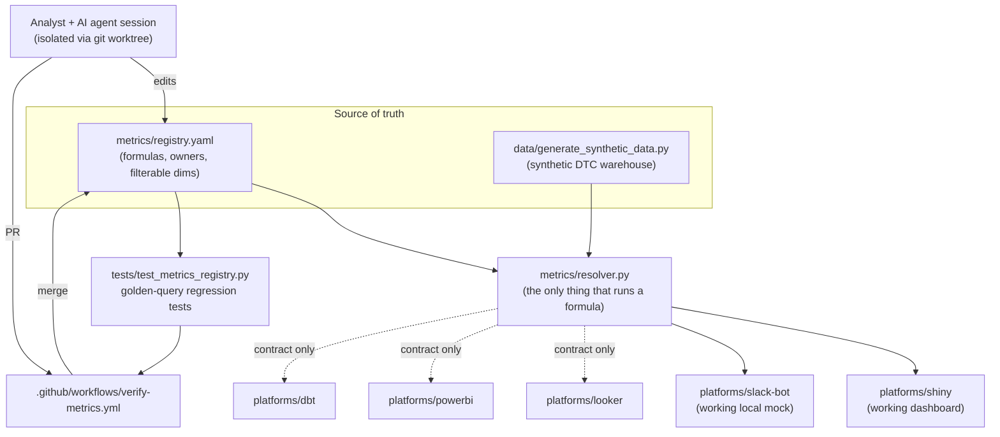

# Architecture

## The core idea

One repo is the shared substrate for a BI team's metrics, templates, and
platform code — and human analysts and AI agent sessions (Claude, or
anything else — see [Agent-agnostic by construction](#agent-agnostic-by-construction))
work against it the same way, through the same registry, under the same
tests.

## Why the registry sits *between* the agent and every platform

The failure mode this architecture exists to prevent: five agent sessions
(Claude, ChatGPT, Copilot — or five human analysts), each asked to "add a
churn chart," each inventing a slightly different churn definition inline
in whatever dashboard/bot code they're writing. The fix isn't a better
prompt — it's making the correct path structurally easier than the wrong
one. `metrics/resolver.py` doesn't expose a way to run arbitrary SQL; it
only exposes `resolve_metric(id, filters)` against
`metrics/registry.yaml`. Generating new dashboard code means calling that
function, not writing a new formula. This holds regardless of who or what
is generating the code, which is the whole point.

## Why the agent reads an instructions file first

The root `CLAUDE.md` is the explicit instruction set this repo ships for
Claude Code: where the registry lives, that it's authoritative, and what
"done" looks like (new metric → registry entry + test, not a number
computed inline). Without it, a fresh session has no way to know this
convention exists — it would just write working code, correctly, that
happens to bypass the one rule that matters. `CLAUDE.md` is what turns "an
agent that writes correct SQL" into "an agent that participates in this
team's governance model."

## Agent-agnostic by construction

Nothing about the mechanism above is Claude-specific, and that's
deliberate — a BI team can't bet its governance model on every analyst
standardizing on one vendor's tool. Separate the two layers and it's
obvious:

- **The enforcement layer** — `metrics/resolver.py`, the golden-query
  tests, the CI gate — is plain Python, YAML, and pytest. It has no
  concept of "Claude." It rejects a bad change the same way whether a
  human, Claude, ChatGPT, Cursor, or Copilot produced it. This layer is
  *why* the governance holds, and it has zero AI dependency — an analyst
  hand-writing SQL against `metrics.resolver.resolve_metric()` gets
  exactly the same guarantees an agent does.
- **The instruction layer** — `CLAUDE.md` — is the one piece that's
  tool-specific, because Claude Code specifically looks for that exact
  filename. It's not special content, though: it's this repo's instance
  of a pattern most agent tooling now supports in some form (a root
  instructions file, an `AGENTS.md`, a `.cursorrules`, a Copilot
  custom-instructions file, or a pasted system prompt for a tool with no
  native mechanism). Point a different agent at this repo with an
  equivalent instructions file and the same rule applies, because the
  instructions layer only ever does one job: tell the agent the
  enforcement layer exists and that it's not optional.

The practical implication: this repo's core bet isn't "use Claude." It's
"put the governance in code and tests, not in a prompt or in trust," which
is a bet that pays off identically whether the team standardizes on one
agent, several, or none at all.

## What's real vs. what's a contract

- **Real, tested, running:** the registry, the resolver, the synthetic
  data generator, the Shiny app, the Slack bot mock, the pytest suite, the
  CI workflow.
- **Documented but not built:** Looker, Power BI, and dbt adapters (see
  their READMEs under `platforms/`). Building all of them would prove the
  same point three more times at three times the cost — the docs exist so
  the pattern's reach is legible without that cost.

## How this scales past a demo

`docs/WORKTREE_WORKFLOW.md` covers running multiple agent sessions on one
analyst's machine in parallel. `docs/VERIFICATION.md` covers what actually
stops a bad change from shipping. `docs/METRICS_REGISTRY.md` covers the
governance rule itself. Together those three, plus this diagram, are the
whole architecture — everything else in the repo is one instance of it
applied to a synthetic e-commerce business.
